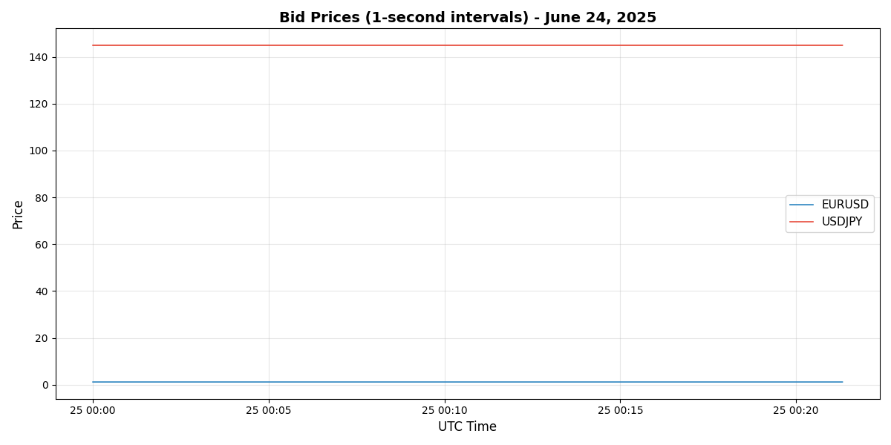
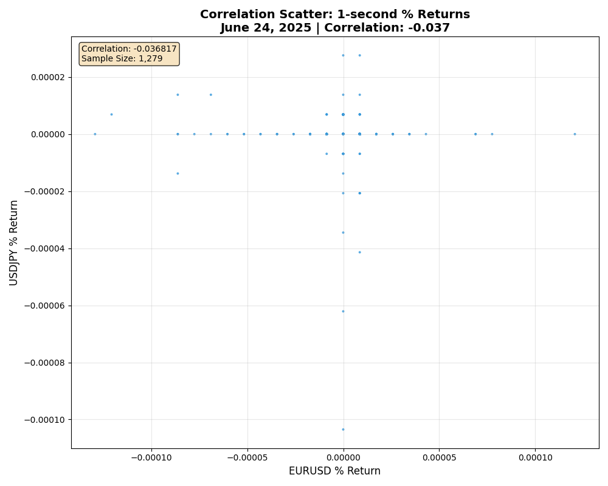

# 📈 Forex Tick Analysis - Currency Correlation Study

> 🚀 High-frequency analysis of EUR/USD vs USD/JPY correlation patterns

## 🎯 Project Overview

Analyzes 1-second forex tick data to discover correlation patterns between EUR/USD and USD/JPY currency pairs using MetaTrader 5 data.

## 🔍 What It Does

- Downloads real-time tick data from MT5
- Resamples to 1-second intervals
- Calculates correlations and covariance between currency pairs
- Generates price charts and correlation scatter plots
- Saves data as CSV files for further analysis

## 💡 Key Insights

Reveals how forex correlations are **dynamic** and change throughout the trading day. Currency pairs can show strong negative correlations during active periods or near-zero correlations during quiet sessions.

## 📊 Mathematical Background

**Correlation** measures how two currencies move together, ranging from -1 to +1:
- **+1**: Perfect positive correlation (move in same direction)
- **0**: No correlation (independent movement)  
- **-1**: Perfect negative correlation (move in opposite directions)

**Covariance** measures the actual magnitude of co-movement between price changes, showing both direction and strength of the relationship.

## 📈 Generated Charts

## 📁 Files Structure

- `main.py` - Main analysis script
- `ticks_*.csv` - Downloaded tick data
- `images/` - Generated visualization charts
- `README.md` - This documentation

## 🚀 Usage

Run the script to analyze today's forex data and generate correlation insights.

---

*Discover dynamic forex relationships through high-frequency data analysis* 💱